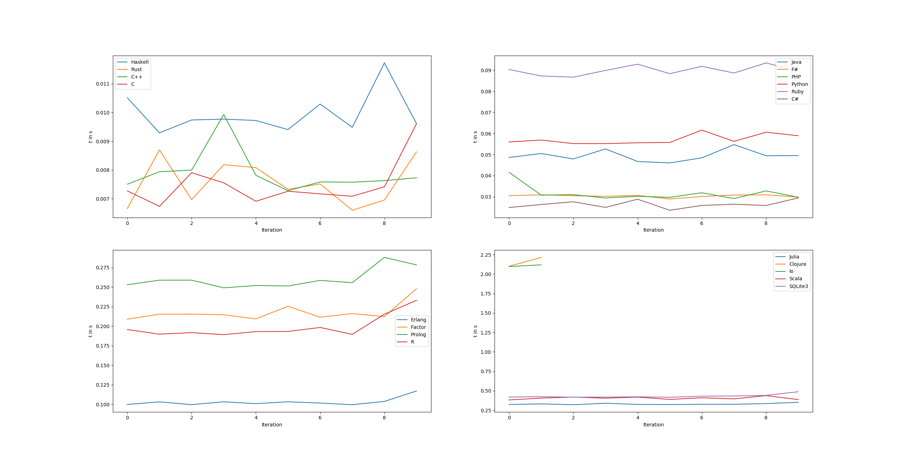

# Numeric Integration

Implementation of numeric integration using simpsons method in various languages

## Current languages

- C
- Rust
- Haskell
- Python
- C++
- PHP
- Julia
- R
- Java (Could use a more idiomatic implementationNumerical_Integration from someone that actually knows the language though)
- Matlab
- SQLite3 (sue me)
- C#
- F#
- Ruby
- Io
- SWI-Prolog
- Scala
- Erlang
- Clojure
- Factor (Thanks to _u/chunes_ on reddit for helping me with _inline_ and the _call(_ annotation)
- Chez Scheme

## Graph of startup + runtime

